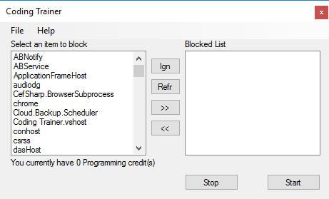

# What is Coding Trainer?

Coding trainer is a project to encourage users to code more and not procrastinate. This is done by incentivizing users to work on their code in order to access certain "fun" programs.

# How does it work?

The program is a [daemon](https://en.wikipedia.org/wiki/Daemon_(computing)) that monitors opened processes. For example, if the user opens a game, a game client or other specified programs, the application will be forcefully closed and a warning will pop up, such as "Not enough credits to play".

* Credits will be earned hourly so long as your IDE is open and focused
* Credit will be deducted while game clients are open
* Allow user to select the programs in white box

# Inspiration

This was inspired by the Oasis fitness trainer in the book, [Ready Player One](https://en.wikipedia.org/wiki/Ready_Player_One). Where Wade had to do a certain amount of exercise daily to enable access to the Oasis. In the end he became healthier and fitter. 

# Coding Trainer UI

Despite the fact that this program is a daemon process, users have asked that it have a UI to select the programs that they wish to have locked from easy access. 

With the UI, you can select the currently running processes you wish to block.

>I'd suggest blocking game clients as most games require their clients to run in the background

# How can you help?

Fork or email me at Info@IronPhreak.com
 Add your pull request, if it meets standards and adds functionality to the program they will be added.
 I welcome any suggestions and ideas
