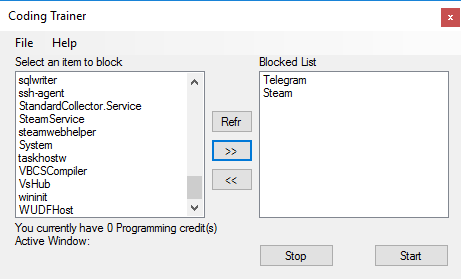

# What is Coding Trainer?

Coding trainer is a project to encourage users to code more and not procrastinate. This is done by incentivizing users to work on their code in order to access certain "fun" programs.

# How does it work?

The program is a [daemon](https://en.wikipedia.org/wiki/Daemon_(computing)) that monitors opened processes. 

To add to the blocked process list, the target process must be open first, so open and minimise fullscreen games. If you can't see the process on the list, it the "Ref" (Refresh) button to reload the list. Once you selected it, click the ">>" button to add it to the list.

When you have 1 or more blocked items, click "Start"

So long as one of the monitored IDEs is open and focused (top most window) credits will be counted. Blocked proccesses will be closed automatically if the user has 0 credits. But if the user has 1 or more, blocked app is allowed to be opened with a credit deduction.

For example: If the user has blocked the Steam process, with 0 credits, each time the user opens steam, it'll be closed straight away. After 30 minutes of active IDE time, 1 credit will be awarded and will allow steam to open.

In the current version, the tracker will stop once a blocked process is opened when the user has 1 or more credits and must be restarted in order to block again, however your credits will remain (so long as the app remains open)

# Disclaimer

If you aren't already aware, this app will force close selected processes on your system, currently it's set to not display common processes (such as explorer). This means that any process that you select and forcefully close is down to you, I hold no responsibility if you select a process which leads to system instablity. Please be careful when selecting.

# IDEs that get tracked 

Currently the following IDEs are tracked 
* Microsoft visual Studio
* Pycharm
* Aton (Needs testing)

If you can assist in adding more, please let me know. Currently it's monitored by the window title, so if the title contains "Visual Studio" then this will allow points added.

# Inspiration

This was inspired by the Oasis fitness trainer in the book, [Ready Player One](https://en.wikipedia.org/wiki/Ready_Player_One). Where Wade had to do a certain amount of exercise daily to enable access to the Oasis. In the end he became healthier and fitter. 

# Coding Trainer UI

Despite the fact that this program is a daemon process, users have asked that it have a UI to select the programs that they wish to have locked from easy access. 

With the UI, you can select the currently running processes you wish to block.

>I'd suggest blocking game clients as most games require their clients to run in the background

# How can you help?

Fork or email me at Info@IronPhreak.com
 Add your pull request, if it meets standards and adds functionality to the program they will be added.
 I welcome any suggestions and ideas
 
 
 # What's stopping me just opening what I want without this app?
 
 In truth, nothing. This isn't meant to restrict or change how you work, more so encourage. Chances are you will use this once and that's all. But if you want to have a slight help in automatically closing those games, then this might help.
